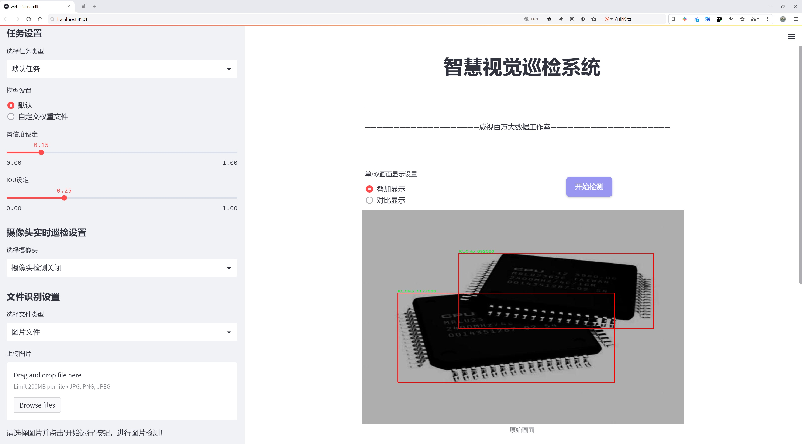
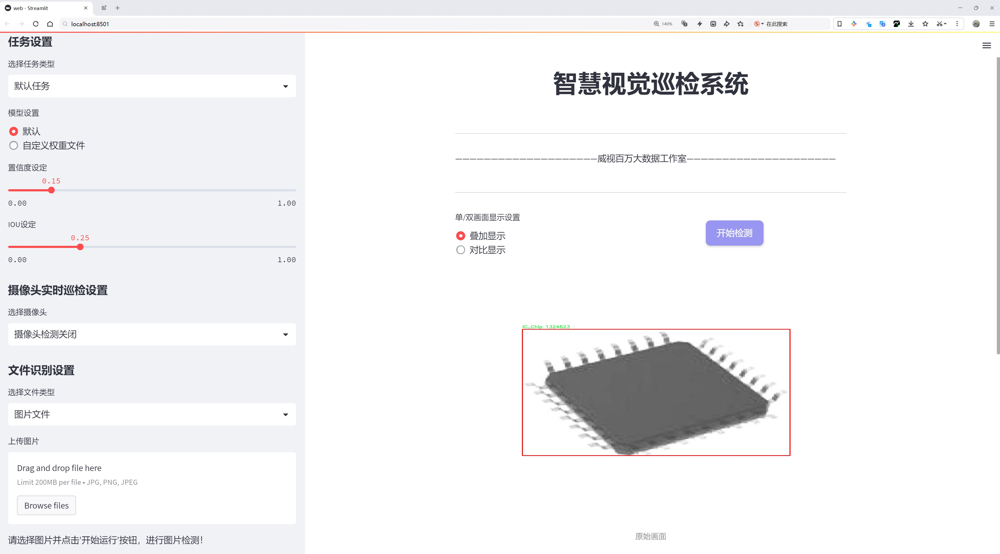
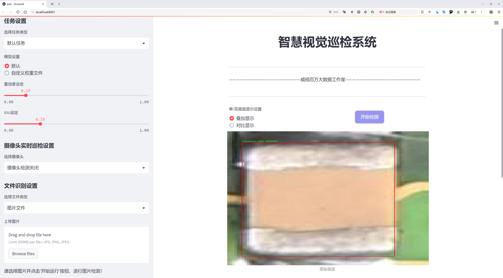
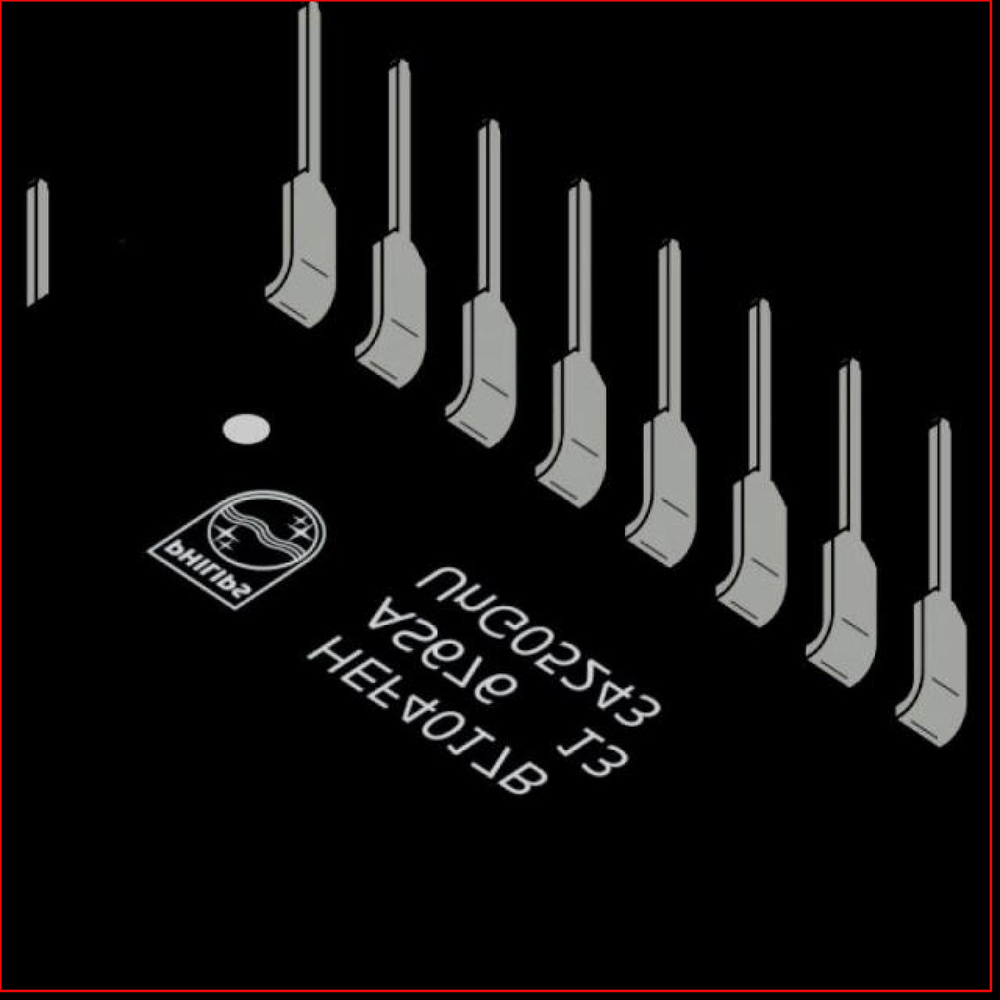
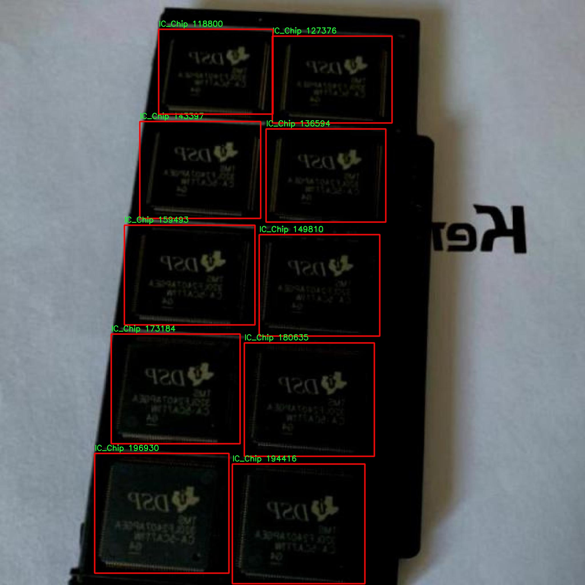
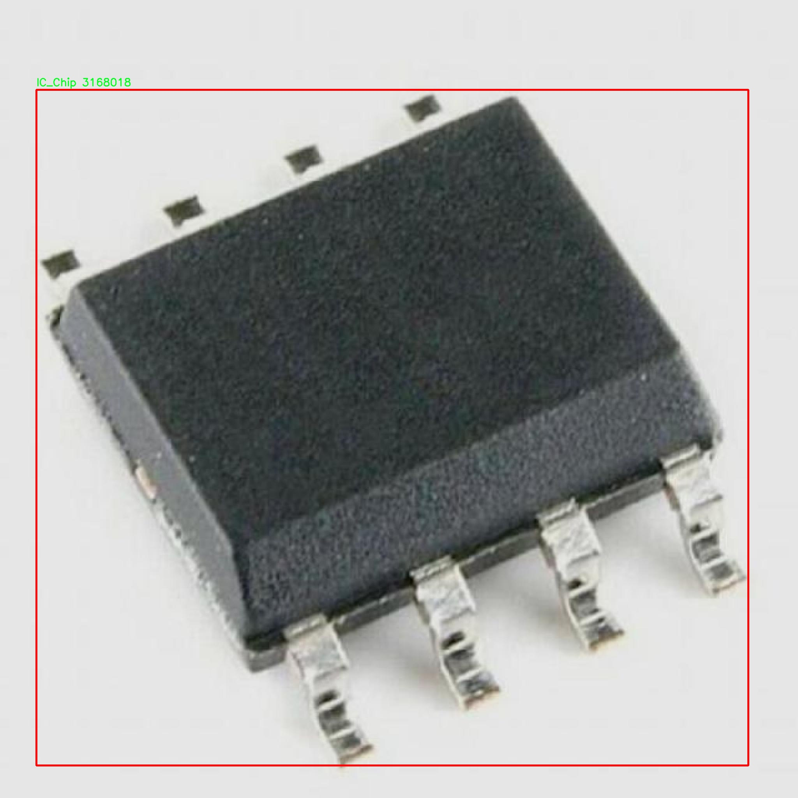
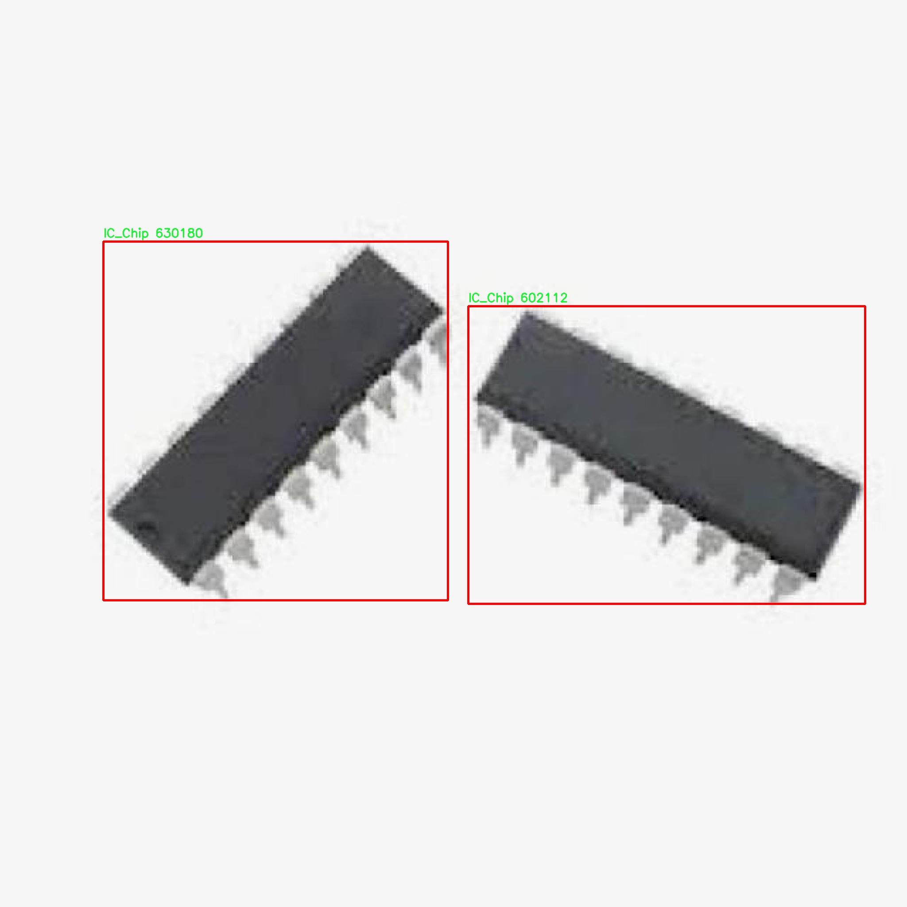
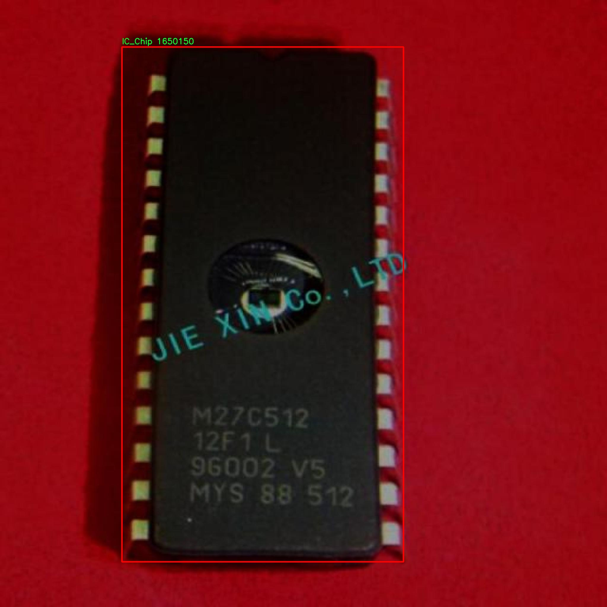

# 电路板上电子元件检测检测系统源码分享
 # [一条龙教学YOLOV8标注好的数据集一键训练_70+全套改进创新点发刊_Web前端展示]

### 1.研究背景与意义

项目参考[AAAI Association for the Advancement of Artificial Intelligence](https://gitee.com/qunmasj/projects)

项目来源[AACV Association for the Advancement of Computer Vision](https://kdocs.cn/l/cszuIiCKVNis)

研究背景与意义

随着电子技术的迅猛发展，电路板上电子元件的种类和数量日益增加，如何高效、准确地检测和识别这些元件成为了电子制造行业中的一项重要挑战。传统的人工检测方法不仅耗时耗力，而且容易受到人为因素的影响，导致检测结果的不稳定性和不准确性。因此，基于计算机视觉和深度学习的自动化检测系统逐渐成为研究的热点。近年来，YOLO（You Only Look Once）系列目标检测算法因其高效性和实时性在各类视觉任务中取得了显著的成果，其中YOLOv8作为最新版本，进一步提升了检测精度和速度，适用于复杂场景下的目标识别。

本研究旨在基于改进的YOLOv8算法，构建一个针对电路板上电子元件的检测系统。该系统将利用“test2 pcb real”数据集，该数据集包含2128张图像，涵盖了五类电子元件：SMD电容器、SMD二极管、集成电路芯片、SMD电感器和SMD电阻器。这些元件在现代电子设备中扮演着至关重要的角色，其准确识别和定位对电路板的组装和故障排查具有重要意义。

在数据集的构建过程中，涵盖了多种不同的拍摄角度、光照条件和背景环境，确保了模型在实际应用中的鲁棒性。通过对这些图像的深度学习训练，模型将能够学习到不同电子元件的特征，从而实现高效的自动检测。这一过程不仅提高了检测的准确性，还大幅度降低了人工干预的需求，提升了生产效率。

此外，基于YOLOv8的检测系统还具有良好的实时性，能够在生产线上快速处理图像，及时反馈检测结果。这对于快速迭代的电子产品生产具有重要的现实意义，能够有效缩短产品的上市时间，提升企业的市场竞争力。同时，该系统的成功应用也为后续的智能制造和工业4.0的发展提供了技术支持，推动了智能检测技术在更广泛领域的应用。

总之，基于改进YOLOv8的电路板上电子元件检测系统的研究，不仅具有重要的理论价值，还具备广泛的应用前景。通过对该系统的深入研究，能够为电子制造行业提供一种高效、准确的自动检测解决方案，促进智能制造的发展，提升整个行业的技术水平和生产效率。这一研究将为未来的电子元件检测技术奠定基础，推动相关领域的进一步探索与创新。

### 2.图片演示







##### 注意：由于此博客编辑较早，上面“2.图片演示”和“3.视频演示”展示的系统图片或者视频可能为老版本，新版本在老版本的基础上升级如下：（实际效果以升级的新版本为准）

  （1）适配了YOLOV8的“目标检测”模型和“实例分割”模型，通过加载相应的权重（.pt）文件即可自适应加载模型。

  （2）支持“图片识别”、“视频识别”、“摄像头实时识别”三种识别模式。

  （3）支持“图片识别”、“视频识别”、“摄像头实时识别”三种识别结果保存导出，解决手动导出（容易卡顿出现爆内存）存在的问题，识别完自动保存结果并导出到tempDir中。

  （4）支持Web前端系统中的标题、背景图等自定义修改，后面提供修改教程。

  另外本项目提供训练的数据集和训练教程,暂不提供权重文件（best.pt）,需要您按照教程进行训练后实现图片演示和Web前端界面演示的效果。

### 3.视频演示

[3.1 视频演示](https://www.bilibili.com/video/BV1yHxgefEDr/)

### 4.数据集信息展示

##### 4.1 本项目数据集详细数据（类别数＆类别名）

nc: 5
names: ['Capasistor_SMD', 'Diode_SMD', 'IC_Chip', 'Inductor_SMD', 'Resistor_SMD']


##### 4.2 本项目数据集信息介绍

数据集信息展示

在本研究中，我们使用了名为“test2 pcb real”的数据集，旨在改进YOLOv8模型在电路板上电子元件检测系统中的表现。该数据集专门为电子元件的识别与分类而设计，包含了多种常见的电子元件类型，以支持模型的训练和优化。通过精心标注和丰富的样本，数据集为模型提供了必要的多样性和复杂性，使其能够在实际应用中更有效地识别和分类电路板上的元件。

“test2 pcb real”数据集包含五个主要类别，分别是：电容器（Capasistor_SMD）、二极管（Diode_SMD）、集成电路芯片（IC_Chip）、电感器（Inductor_SMD）和电阻器（Resistor_SMD）。这些类别涵盖了现代电路板中最常见的电子元件，具有广泛的应用价值。每个类别的样本数量和多样性均经过精心设计，以确保模型在训练过程中能够充分学习到每种元件的特征。

在数据集的构建过程中，研究团队对每种电子元件进行了详细的标注和分类。通过高质量的图像采集和后期处理，确保了数据集中的每个样本都具备清晰的视觉信息和准确的标签。这种高标准的标注不仅提高了模型的训练效率，也增强了其在实际应用中的可靠性。特别是在电路板检测任务中，元件的外观、形状和位置的细微差别可能会影响最终的检测结果，因此，数据集的精确性显得尤为重要。

为了提高模型的泛化能力，数据集中包含了不同角度、不同光照条件下拍摄的电子元件图像。这种多样化的样本选择使得模型能够适应不同的实际环境，从而在真实场景中实现更高的检测准确率。此外，数据集还考虑到了电路板上元件的排列方式和密集度，确保模型在面对复杂电路板时，依然能够保持良好的识别性能。

在训练过程中，研究者们将“test2 pcb real”数据集与YOLOv8模型相结合，利用其先进的特征提取和检测能力，力求在电子元件的检测任务中取得突破性进展。通过不断迭代和优化，模型在训练集上的表现得到了显著提升，同时也在验证集和测试集上展现出了良好的泛化能力。这一过程不仅验证了数据集的有效性，也为后续的研究提供了宝贵的经验和数据支持。

总之，“test2 pcb real”数据集为改进YOLOv8在电路板电子元件检测中的应用提供了坚实的基础。通过丰富的样本和精确的标注，该数据集不仅提升了模型的训练效果，也为实际应用中的电路板检测任务奠定了良好的基础。未来，随着数据集的不断扩展和模型的进一步优化，我们期待在电子元件检测领域取得更大的进展和应用成果。











### 5.全套项目环境部署视频教程（零基础手把手教学）

[5.1 环境部署教程链接（零基础手把手教学）](https://www.ixigua.com/7404473917358506534?logTag=c807d0cbc21c0ef59de5)


[5.2 安装Python虚拟环境创建和依赖库安装视频教程链接（零基础手把手教学）](https://www.ixigua.com/7404474678003106304?logTag=1f1041108cd1f708b01a)

### 6.手把手YOLOV8训练视频教程（零基础小白有手就能学会）

[6.1 手把手YOLOV8训练视频教程（零基础小白有手就能学会）](https://www.ixigua.com/7404477157818401292?logTag=d31a2dfd1983c9668658)

### 7.70+种全套YOLOV8创新点代码加载调参视频教程（一键加载写好的改进模型的配置文件）

[7.1 70+种全套YOLOV8创新点代码加载调参视频教程（一键加载写好的改进模型的配置文件）](https://www.ixigua.com/7404478314661806627?logTag=29066f8288e3f4eea3a4)

### 8.70+种全套YOLOV8创新点原理讲解（非科班也可以轻松写刊发刊，V10版本正在科研待更新）

由于篇幅限制，每个创新点的具体原理讲解就不一一展开，具体见下列网址中的创新点对应子项目的技术原理博客网址【Blog】：


[8.1 70+种全套YOLOV8创新点原理讲解链接](https://gitee.com/qunmasj/good)

### 9.系统功能展示（检测对象为举例，实际内容以本项目数据集为准）

图9.1.系统支持检测结果表格显示

  图9.2.系统支持置信度和IOU阈值手动调节

  图9.3.系统支持自定义加载权重文件best.pt(需要你通过步骤5中训练获得)

  图9.4.系统支持摄像头实时识别

  图9.5.系统支持图片识别

  图9.6.系统支持视频识别

  图9.7.系统支持识别结果文件自动保存

  图9.8.系统支持Excel导出检测结果数据


### 10.原始YOLOV8算法原理

原始YOLOv8算法原理

YOLOv8是Ultralytics于2023年1月发布的最新目标检测模型，它不仅是YOLO系列的延续，更是对前几代算法的综合与优化。作为一种单阶段检测算法，YOLOv8在设计上充分考虑了实时性与精度的平衡，力求在复杂环境中实现高效的目标检测。该模型的架构主要由输入层、主干网络、颈部网络和头部网络四个部分构成，各个模块相辅相成，共同推动了YOLOv8在目标检测领域的卓越表现。

在输入层，YOLOv8首先对输入图像进行预处理，以适应模型的输入尺寸要求。这一过程包括图像的缩放、裁剪和增强，尤其是Mosaic增强技术的应用，使得模型在训练时能够获得更丰富的样本变换，从而提升模型的泛化能力。YOLOv8的输入层还引入了瞄点计算机制，以提高目标检测的准确性。

接下来是主干网络部分，YOLOv8在这一模块中采用了改进的DarkNet结构。与之前的YOLO版本不同，YOLOv8使用了C2f模块来替代C3模块。C2f模块通过跨层连接的方式，增强了模型的梯度流动，确保了信息在网络中的有效传递。这种设计不仅保留了轻量级特性，还使得模型在处理不同尺度的特征时，能够更好地捕捉到细节信息。此外，主干网络末尾的SPPF模块通过引入多种内核尺寸的最大池化层，进一步提升了特征图的抽象能力，使得模型能够有效应对多尺度目标的检测需求。

颈部网络是YOLOv8的重要组成部分，它结合了特征金字塔网络（FPN）和路径聚合网络（PAN）的优势，形成了双塔结构。这一结构不仅促进了不同尺度特征图的信息融合，还增强了语义特征与定位特征之间的传递能力。通过对特征的有效融合，YOLOv8能够在不同的检测任务中获取更丰富的特征信息，从而提升对小目标和复杂场景的检测性能。

最后，YOLOv8的头部网络采用了解耦的检测头结构，分别计算回归和分类的损失。这种设计使得模型在训练时能够更快地收敛，进而提高检测精度。YOLOv8的检测模块包含三个独立的检测器，通过并行的卷积分支进行目标的定位与分类，极大地提升了模型的检测速度和效率。

YOLOv8的优势不仅体现在其高效的网络结构上，还在于其在训练过程中所采用的多种技术手段。比如，YOLOv8在损失函数的设计上借鉴了PP-YOLOE的相关设计，优化了目标检测的损失计算，使得模型在面对复杂场景时，能够更准确地进行目标定位与分类。此外，YOLOv8还引入了自适应锚框机制，通过动态调整锚框的大小和形状，进一步提升了对不同目标的检测能力。

综上所述，YOLOv8通过对前几代YOLO算法的优势进行整合与优化，形成了一种高效、准确的目标检测模型。其在特征提取、特征融合和检测头设计等方面的创新，使得YOLOv8在实时检测领域达到了一个新的高度。无论是在工业应用还是学术研究中，YOLOv8都展现出了强大的潜力，尤其是在复杂环境下的目标检测任务中，YOLOv8的表现无疑将为相关领域带来新的冲击与启示。随着技术的不断进步，YOLOv8将继续推动目标检测技术的发展，为自动化和智能化的未来奠定坚实的基础。


### 11.项目核心源码讲解（再也不用担心看不懂代码逻辑）

#### 11.1 ui.py

以下是对代码的核心部分进行提炼和详细注释的版本：

```python
import sys
import subprocess

def run_script(script_path):
    """
    使用当前 Python 环境运行指定的脚本。

    Args:
        script_path (str): 要运行的脚本路径

    Returns:
        None
    """
    # 获取当前 Python 解释器的路径
    python_path = sys.executable

    # 构建运行命令，使用 streamlit 运行指定的脚本
    command = f'"{python_path}" -m streamlit run "{script_path}"'

    # 执行命令，并等待其完成
    result = subprocess.run(command, shell=True)
    
    # 检查命令执行的返回码，如果不为0，表示出错
    if result.returncode != 0:
        print("脚本运行出错。")

# 主程序入口
if __name__ == "__main__":
    # 指定要运行的脚本路径
    script_path = "web.py"  # 这里可以直接指定脚本名

    # 调用函数运行脚本
    run_script(script_path)
```

### 代码分析与注释：

1. **导入模块**：
   - `sys`：用于访问与 Python 解释器紧密相关的变量和函数。
   - `subprocess`：用于执行外部命令和程序。

2. **`run_script` 函数**：
   - 该函数接收一个脚本路径作为参数，并使用当前 Python 环境来运行该脚本。
   - `python_path = sys.executable`：获取当前 Python 解释器的完整路径，以确保使用正确的 Python 环境。
   - `command`：构建一个字符串命令，用于调用 `streamlit` 来运行指定的脚本。
   - `subprocess.run(command, shell=True)`：执行构建的命令，并等待其完成。`shell=True` 允许在 shell 中执行命令。
   - `result.returncode`：检查命令的返回码，0 表示成功，非0 表示出错。

3. **主程序入口**：
   - `if __name__ == "__main__":`：确保只有在直接运行该脚本时才会执行以下代码，而不是在被导入时执行。
   - `script_path = "web.py"`：指定要运行的脚本路径。
   - `run_script(script_path)`：调用 `run_script` 函数，传入脚本路径以执行该脚本。

通过以上分析和注释，可以清晰地理解代码的功能和结构。

这个程序文件名为 `ui.py`，它的主要功能是通过当前的 Python 环境来运行一个指定的脚本，具体来说是一个名为 `web.py` 的脚本。文件中首先导入了几个必要的模块，包括 `sys`、`os` 和 `subprocess`，以及一个自定义的函数 `abs_path`，这个函数可能用于获取文件的绝对路径。

在 `run_script` 函数中，程序接受一个参数 `script_path`，这个参数是要运行的脚本的路径。函数内部首先获取当前 Python 解释器的路径，接着构建一个命令字符串，这个命令字符串用于调用 `streamlit` 来运行指定的脚本。`streamlit` 是一个用于构建数据应用的框架，通常用于快速开发和展示数据应用。

然后，使用 `subprocess.run` 方法来执行这个命令。这个方法会在一个新的进程中运行命令，并等待其完成。如果命令执行的返回码不为零，表示脚本运行过程中出现了错误，程序会打印出一条错误信息。

在文件的最后部分，使用 `if __name__ == "__main__":` 语句来确保当这个文件作为主程序运行时，才会执行后面的代码。在这里，程序指定了要运行的脚本路径为 `web.py`，并调用 `run_script` 函数来执行这个脚本。

总体来说，这个程序的主要作用是封装了一个运行特定 Python 脚本的功能，方便用户通过命令行启动一个基于 `streamlit` 的应用。

#### 11.2 code\ultralytics\engine\tuner.py

以下是经过简化和注释的核心代码部分，主要关注超参数调优的实现：

```python
class Tuner:
    """
    负责YOLO模型超参数调优的类。

    该类通过对超参数进行变异，进而在给定的迭代次数内演化YOLO模型的超参数，
    并重新训练模型以评估其性能。
    """

    def __init__(self, args=DEFAULT_CFG, _callbacks=None):
        """
        初始化Tuner类，配置超参数演化的相关设置。

        参数:
            args (dict, optional): 超参数演化的配置。
        """
        # 定义超参数搜索空间，包括每个超参数的最小值、最大值和可选的增益
        self.space = args.pop("space", None) or {
            "lr0": (1e-5, 1e-1),  # 初始学习率
            "momentum": (0.7, 0.98, 0.3),  # 动量
            "weight_decay": (0.0, 0.001),  # 权重衰减
            # 其他超参数...
        }
        self.args = get_cfg(overrides=args)  # 获取配置
        self.tune_dir = get_save_dir(self.args, name="tune")  # 设置保存目录
        self.tune_csv = self.tune_dir / "tune_results.csv"  # 结果CSV文件路径
        self.callbacks = _callbacks or callbacks.get_default_callbacks()  # 设置回调
        LOGGER.info(f"Initialized Tuner instance with 'tune_dir={self.tune_dir}'")

    def _mutate(self, parent="single", n=5, mutation=0.8, sigma=0.2):
        """
        根据超参数搜索空间的边界和缩放因子变异超参数。

        参数:
            parent (str): 父代选择方法: 'single' 或 'weighted'。
            n (int): 考虑的父代数量。
            mutation (float): 在给定迭代中参数变异的概率。
            sigma (float): 高斯随机数生成器的标准差。

        返回:
            dict: 包含变异后超参数的字典。
        """
        if self.tune_csv.exists():  # 如果CSV文件存在，选择最佳超参数进行变异
            # 读取CSV文件中的超参数
            x = np.loadtxt(self.tune_csv, ndmin=2, delimiter=",", skiprows=1)
            fitness = x[:, 0]  # 第一列为适应度
            n = min(n, len(x))  # 考虑的结果数量
            x = x[np.argsort(-fitness)][:n]  # 选择适应度最高的n个超参数
            # 选择父代
            w = x[:, 0] - x[:, 0].min() + 1e-6  # 权重
            if parent == "single" or len(x) == 1:
                x = x[random.choices(range(n), weights=w)[0]]  # 加权选择
            elif parent == "weighted":
                x = (x * w.reshape(n, 1)).sum(0) / w.sum()  # 加权组合

            # 变异超参数
            r = np.random
            r.seed(int(time.time()))
            g = np.array([v[2] if len(v) == 3 else 1.0 for k, v in self.space.items()])  # 增益
            ng = len(self.space)
            v = np.ones(ng)
            while all(v == 1):  # 确保有变异发生
                v = (g * (r.random(ng) < mutation) * r.randn(ng) * r.random() * sigma + 1).clip(0.3, 3.0)
            hyp = {k: float(x[i + 1] * v[i]) for i, k in enumerate(self.space.keys())}
        else:
            hyp = {k: getattr(self.args, k) for k in self.space.keys()}  # 初始化超参数

        # 限制超参数在边界内
        for k, v in self.space.items():
            hyp[k] = max(hyp[k], v[0])  # 下限
            hyp[k] = min(hyp[k], v[1])  # 上限
            hyp[k] = round(hyp[k], 5)  # 保留五位有效数字

        return hyp

    def __call__(self, model=None, iterations=10, cleanup=True):
        """
        执行超参数演化过程。

        参数:
           model (Model): 预初始化的YOLO模型。
           iterations (int): 演化的代数。
           cleanup (bool): 是否在调优过程中删除迭代权重以减少存储空间。

        注意:
           此方法利用self.tune_csv路径对象读取和记录超参数及适应度分数。
        """
        t0 = time.time()
        for i in range(iterations):
            # 变异超参数
            mutated_hyp = self._mutate()
            LOGGER.info(f"Starting iteration {i + 1}/{iterations} with hyperparameters: {mutated_hyp}")

            metrics = {}
            train_args = {**vars(self.args), **mutated_hyp}  # 合并超参数
            save_dir = get_save_dir(get_cfg(train_args))  # 获取保存目录
            ckpt_file = save_dir / "best.pt"  # 检查最佳模型文件

            try:
                # 训练YOLO模型
                cmd = ["yolo", "train", *(f"{k}={v}" for k, v in train_args.items())]
                return_code = subprocess.run(cmd, check=True).returncode
                metrics = torch.load(ckpt_file)["train_metrics"]  # 加载训练指标
                assert return_code == 0, "training failed"

            except Exception as e:
                LOGGER.warning(f"WARNING ❌️ training failure for hyperparameter tuning iteration {i + 1}\n{e}")

            # 保存结果到CSV
            fitness = metrics.get("fitness", 0.0)
            log_row = [round(fitness, 5)] + [mutated_hyp[k] for k in self.space.keys()]
            with open(self.tune_csv, "a") as f:
                f.write(",".join(map(str, log_row)) + "\n")

            # 获取最佳结果
            x = np.loadtxt(self.tune_csv, ndmin=2, delimiter=",", skiprows=1)
            fitness = x[:, 0]  # 第一列为适应度
            best_idx = fitness.argmax()  # 找到最佳适应度的索引

            # 打印和保存调优结果
            header = f'{i + 1}/{iterations} iterations complete ✅ ({time.time() - t0:.2f}s)\n'
            LOGGER.info(header)
```

### 代码说明：
1. **Tuner类**：负责超参数调优的核心类，包含初始化、变异超参数和执行调优的主要逻辑。
2. **初始化方法**：设置超参数搜索空间、配置和保存路径。
3. **_mutate方法**：根据历史结果变异超参数，确保变异后的超参数在指定范围内。
4. **__call__方法**：执行超参数演化过程，包括变异、训练模型、记录结果等。

这个程序文件是Ultralytics YOLO模型的超参数调优模块，主要用于对象检测、实例分割、图像分类、姿态估计和多目标跟踪等任务。超参数调优是一个系统化的过程，旨在寻找最佳的超参数组合，以提高模型的性能。在深度学习模型如YOLO中，超参数的微小变化可能会导致模型准确性和效率的显著差异。

在代码中，首先导入了一些必要的库，包括随机数生成、文件操作、时间处理、NumPy和PyTorch等。接着，定义了一个名为`Tuner`的类，该类负责YOLO模型的超参数调优。类中包含了一些属性，例如超参数搜索空间、调优结果保存目录和CSV文件路径等。

`Tuner`类的构造函数初始化了一些配置，包括超参数的搜索空间，这些超参数包括学习率、动量、权重衰减、图像增强参数等。搜索空间定义了每个超参数的最小值和最大值，以及可选的增益因子。构造函数还设置了日志记录和回调函数，并创建了用于保存调优结果的目录。

类中有两个主要方法：`_mutate`和`__call__`。`_mutate`方法负责根据搜索空间对超参数进行变异，生成新的超参数组合。它首先从CSV文件中读取之前的调优结果，并选择最佳的超参数进行变异。变异的过程使用了随机数生成器，确保生成的超参数在指定的范围内，并避免重复。

`__call__`方法是调优过程的核心，它会在指定的迭代次数内执行超参数进化。在每次迭代中，首先加载现有的超参数或初始化新的超参数，然后调用`_mutate`方法生成变异后的超参数。接着，使用这些超参数训练YOLO模型，并记录训练的性能指标和超参数到CSV文件中。该方法还会根据训练结果更新最佳超参数，并在每次迭代结束时绘制调优结果。

整个调优过程包括超参数的变异、模型训练、结果记录和最佳超参数的保存，确保用户能够找到最优的超参数组合以提升模型性能。最后，调优结果会以YAML格式保存，方便用户查看和使用。

#### 11.3 code\ultralytics\hub\__init__.py

以下是代码中最核心的部分，并附上详细的中文注释：

```python
import requests  # 导入requests库，用于发送HTTP请求

from ultralytics.hub.auth import Auth  # 导入身份验证模块
from ultralytics.utils import LOGGER, SETTINGS  # 导入日志记录和设置模块

def login(api_key: str = None, save=True) -> bool:
    """
    使用提供的API密钥登录Ultralytics HUB API。

    Args:
        api_key (str, optional): 用于身份验证的API密钥。如果未提供，将从SETTINGS或HUB_API_KEY环境变量中检索。
        save (bool, optional): 如果身份验证成功，是否将API密钥保存到SETTINGS中。
    Returns:
        bool: 如果身份验证成功则返回True，否则返回False。
    """
    # 检查所需的库是否已安装
    from hub_sdk import HUBClient  # 导入HUB客户端

    # 设置API密钥的URL
    api_key_url = f"{HUB_WEB_ROOT}/settings?tab=api+keys"
    saved_key = SETTINGS.get("api_key")  # 从设置中获取已保存的API密钥
    active_key = api_key or saved_key  # 如果提供了api_key，则使用它，否则使用已保存的密钥
    credentials = {"api_key": active_key} if active_key and active_key != "" else None  # 设置凭据

    client = HUBClient(credentials)  # 初始化HUB客户端

    if client.authenticated:  # 如果身份验证成功
        if save and client.api_key != saved_key:
            SETTINGS.update({"api_key": client.api_key})  # 更新设置中的API密钥

        # 根据提供的密钥或从设置中检索的密钥设置日志消息
        log_message = (
            "New authentication successful ✅" if client.api_key == api_key or not credentials else "Authenticated ✅"
        )
        LOGGER.info(log_message)  # 记录成功信息

        return True  # 返回成功
    else:
        # 身份验证失败
        LOGGER.info(f"Retrieve API key from {api_key_url}")  # 记录获取API密钥的提示
        return False  # 返回失败

def logout():
    """
    从Ultralytics HUB注销，通过从设置文件中删除API密钥。
    """
    SETTINGS["api_key"] = ""  # 清空API密钥
    SETTINGS.save()  # 保存设置
    LOGGER.info("logged out ✅. To log in again, use 'yolo hub login'.")  # 记录注销信息

def export_model(model_id="", format="torchscript"):
    """将模型导出为指定格式。"""
    # 检查导出格式是否支持
    assert format in export_fmts_hub(), f"Unsupported export format '{format}'"
    # 发送POST请求以导出模型
    r = requests.post(
        f"{HUB_API_ROOT}/v1/models/{model_id}/export", 
        json={"format": format}, 
        headers={"x-api-key": Auth().api_key}
    )
    # 检查请求是否成功
    assert r.status_code == 200, f"{format} export failure {r.status_code} {r.reason}"
    LOGGER.info(f"{format} export started ✅")  # 记录导出开始的信息

def check_dataset(path="", task="detect"):
    """
    在上传之前检查HUB数据集Zip文件的错误。
    
    Args:
        path (str, optional): 数据集zip文件的路径，默认值为''。
        task (str, optional): 数据集任务，选项有'detect'、'segment'、'pose'、'classify'，默认值为'detect'。
    """
    # 创建HUB数据集统计对象并获取JSON格式的统计信息
    HUBDatasetStats(path=path, task=task).get_json()
    LOGGER.info("Checks completed correctly ✅. Upload this dataset to {HUB_WEB_ROOT}/datasets/.")  # 记录检查完成的信息
```

### 代码核心部分说明：
1. **登录功能**：`login`函数用于通过API密钥登录Ultralytics HUB，成功后可以选择保存密钥。
2. **注销功能**：`logout`函数用于注销，清空保存的API密钥。
3. **模型导出**：`export_model`函数将指定ID的模型导出为所需格式，支持多种格式。
4. **数据集检查**：`check_dataset`函数用于在上传前检查数据集的完整性和正确性，确保数据集符合要求。

这个程序文件是Ultralytics YOLO（一个用于目标检测的深度学习框架）的Hub模块的初始化文件，主要用于处理与Ultralytics HUB API的交互。文件中包含了一些重要的功能，如用户登录、登出、模型重置、模型导出、数据集检查等。

首先，程序导入了一些必要的库和模块，包括用于发送HTTP请求的requests库，以及Ultralytics的各种工具和设置。接着，定义了一个`login`函数，用于通过API密钥登录Ultralytics HUB。如果没有提供API密钥，函数会尝试从设置或环境变量中获取。成功认证后，可以选择将API密钥保存到设置中。

`logout`函数则用于登出操作，通过清空设置中的API密钥来实现。用户可以在需要时重新登录。

`reset_model`函数允许用户将已训练的模型重置为未训练状态。它通过向HUB API发送POST请求来实现，并根据返回的状态码记录日志，指示重置是否成功。

`export_fmts_hub`函数返回HUB支持的导出格式的列表，用户可以使用这些格式导出模型。`export_model`函数则用于将模型导出为指定格式，确保格式有效后，向HUB API发送请求进行导出，并记录导出状态。

`get_export`函数用于获取已导出的模型的字典，包括下载链接。它同样会检查导出格式的有效性，并通过API请求获取导出信息。

最后，`check_dataset`函数用于在上传数据集到HUB之前进行错误检查。它会检查指定路径下的ZIP文件，确保数据集的格式和内容正确。函数完成后，会记录检查结果，提示用户可以上传数据集。

整体而言，这个文件提供了一系列与Ultralytics HUB交互的功能，帮助用户管理模型和数据集，确保在使用过程中能够顺利进行认证、导出和上传等操作。

#### 11.4 train.py

以下是经过简化和注释的核心代码部分，主要关注于YOLO模型的训练过程和数据处理：

```python
import random
import numpy as np
import torch.nn as nn
from ultralytics.data import build_dataloader, build_yolo_dataset
from ultralytics.engine.trainer import BaseTrainer
from ultralytics.models import yolo
from ultralytics.nn.tasks import DetectionModel
from ultralytics.utils import LOGGER, RANK
from ultralytics.utils.torch_utils import de_parallel, torch_distributed_zero_first

class DetectionTrainer(BaseTrainer):
    """
    基于检测模型的训练类，继承自BaseTrainer类。
    """

    def build_dataset(self, img_path, mode="train", batch=None):
        """
        构建YOLO数据集。

        参数:
            img_path (str): 包含图像的文件夹路径。
            mode (str): 模式，`train`表示训练模式，`val`表示验证模式。
            batch (int, optional): 批次大小，适用于`rect`模式。默认为None。
        """
        gs = max(int(de_parallel(self.model).stride.max() if self.model else 0), 32)  # 获取模型的最大步幅
        return build_yolo_dataset(self.args, img_path, batch, self.data, mode=mode, rect=mode == "val", stride=gs)

    def get_dataloader(self, dataset_path, batch_size=16, rank=0, mode="train"):
        """构建并返回数据加载器。"""
        assert mode in ["train", "val"]  # 确保模式有效
        with torch_distributed_zero_first(rank):  # 在分布式训练中，确保数据集只初始化一次
            dataset = self.build_dataset(dataset_path, mode, batch_size)
        shuffle = mode == "train"  # 训练模式下打乱数据
        workers = self.args.workers if mode == "train" else self.args.workers * 2  # 设置工作线程数
        return build_dataloader(dataset, batch_size, workers, shuffle, rank)  # 返回数据加载器

    def preprocess_batch(self, batch):
        """对图像批次进行预处理，包括缩放和转换为浮点数。"""
        batch["img"] = batch["img"].to(self.device, non_blocking=True).float() / 255  # 将图像转换为浮点数并归一化
        if self.args.multi_scale:  # 如果启用多尺度训练
            imgs = batch["img"]
            sz = (
                random.randrange(self.args.imgsz * 0.5, self.args.imgsz * 1.5 + self.stride)
                // self.stride
                * self.stride
            )  # 随机选择新的图像大小
            sf = sz / max(imgs.shape[2:])  # 计算缩放因子
            if sf != 1:
                ns = [
                    math.ceil(x * sf / self.stride) * self.stride for x in imgs.shape[2:]
                ]  # 计算新的形状
                imgs = nn.functional.interpolate(imgs, size=ns, mode="bilinear", align_corners=False)  # 进行插值
            batch["img"] = imgs  # 更新图像批次
        return batch

    def get_model(self, cfg=None, weights=None, verbose=True):
        """返回YOLO检测模型。"""
        model = DetectionModel(cfg, nc=self.data["nc"], verbose=verbose and RANK == -1)  # 创建检测模型
        if weights:
            model.load(weights)  # 加载权重
        return model

    def plot_training_samples(self, batch, ni):
        """绘制训练样本及其标注。"""
        plot_images(
            images=batch["img"],
            batch_idx=batch["batch_idx"],
            cls=batch["cls"].squeeze(-1),
            bboxes=batch["bboxes"],
            paths=batch["im_file"],
            fname=self.save_dir / f"train_batch{ni}.jpg",
            on_plot=self.on_plot,
        )

    def plot_metrics(self):
        """从CSV文件中绘制指标。"""
        plot_results(file=self.csv, on_plot=self.on_plot)  # 保存结果图
```

### 代码注释说明：
1. **类定义**：`DetectionTrainer`类用于训练YOLO检测模型，继承自`BaseTrainer`。
2. **数据集构建**：`build_dataset`方法用于构建YOLO数据集，支持训练和验证模式。
3. **数据加载器**：`get_dataloader`方法构建数据加载器，支持分布式训练。
4. **批次预处理**：`preprocess_batch`方法对输入图像进行归一化和缩放处理，以适应模型输入。
5. **模型获取**：`get_model`方法用于创建和加载YOLO检测模型。
6. **绘图功能**：`plot_training_samples`和`plot_metrics`方法用于可视化训练样本和训练指标。

这个程序文件 `train.py` 是一个用于训练 YOLO（You Only Look Once）目标检测模型的脚本，继承自 `BaseTrainer` 类。程序的主要功能是构建数据集、创建数据加载器、预处理图像、设置模型属性、获取模型、进行验证、记录损失、显示训练进度以及绘制训练样本和指标。

在文件的开头，导入了一些必要的库和模块，包括数学库、随机数生成、深度学习相关的库（如 PyTorch）以及 Ultralytics 提供的工具和模型。这些工具和模块为训练过程提供了基础功能。

`DetectionTrainer` 类中定义了多个方法。`build_dataset` 方法用于构建 YOLO 数据集，接受图像路径、模式（训练或验证）和批次大小作为参数。它使用 `build_yolo_dataset` 函数来创建数据集，并根据模型的步幅设置合适的图像尺寸。

`get_dataloader` 方法用于构建数据加载器，确保在分布式训练中只初始化一次数据集。它根据模式设置是否打乱数据，并返回构建好的数据加载器。

`preprocess_batch` 方法对图像批次进行预处理，包括将图像缩放到合适的大小并转换为浮点数格式。它还支持多尺度训练，通过随机选择图像尺寸来增强模型的鲁棒性。

`set_model_attributes` 方法用于设置模型的属性，包括类别数量和类别名称，以便模型能够正确识别不同的目标。

`get_model` 方法返回一个 YOLO 检测模型实例，可以选择加载预训练权重。

`get_validator` 方法返回一个用于验证模型性能的 `DetectionValidator` 实例，记录损失值以便后续分析。

`label_loss_items` 方法用于返回带有标签的训练损失字典，便于监控训练过程中的损失变化。

`progress_string` 方法生成一个格式化的字符串，显示训练进度，包括当前的 epoch、GPU 内存使用情况、损失值、实例数量和图像大小。

`plot_training_samples` 方法用于绘制训练样本及其标注，便于可视化训练过程中的数据。

最后，`plot_metrics` 和 `plot_training_labels` 方法用于绘制训练过程中的指标和标签，帮助分析模型的训练效果。

总体来说，这个程序文件提供了一个完整的框架，用于训练 YOLO 模型，涵盖了数据处理、模型构建、训练监控和结果可视化等多个方面。

#### 11.5 code\ultralytics\solutions\__init__.py

以下是代码的核心部分，并附上详细的中文注释：

```python
# Ultralytics YOLO 🚀, AGPL-3.0 license

# 该代码是Ultralytics YOLO（You Only Look Once）模型的实现，属于AGPL-3.0许可证下的开源项目。
# YOLO是一种实时目标检测系统，能够在图像中快速识别和定位多个对象。

# 下面是YOLO模型的核心功能和结构的简要概述：

class YOLO:
    def __init__(self, model_path):
        """
        初始化YOLO模型
        :param model_path: 模型文件的路径
        """
        self.model_path = model_path
        self.load_model()

    def load_model(self):
        """
        加载YOLO模型
        """
        # 在这里加载模型权重和配置
        pass

    def detect(self, image):
        """
        在给定的图像上进行目标检测
        :param image: 输入图像
        :return: 检测到的对象及其位置
        """
        # 在这里进行图像预处理、模型推理和后处理
        pass

# 示例用法
if __name__ == "__main__":
    yolo = YOLO("path/to/model.pt")  # 创建YOLO对象并加载模型
    results = yolo.detect("path/to/image.jpg")  # 在图像上进行检测
    print(results)  # 输出检测结果
```

### 注释说明：
1. **类定义**：`class YOLO` 定义了一个YOLO模型的类，包含初始化和检测功能。
2. **初始化方法**：`__init__` 方法用于初始化YOLO对象，接收模型路径并调用加载模型的方法。
3. **加载模型**：`load_model` 方法负责加载YOLO模型的权重和配置文件，具体实现需要补充。
4. **目标检测方法**：`detect` 方法接收输入图像并进行目标检测，返回检测到的对象及其位置信息，具体实现同样需要补充。
5. **示例用法**：在主程序中创建YOLO对象并加载模型，然后在指定图像上进行检测，并输出结果。

这段代码的核心部分展示了YOLO模型的基本结构和功能，便于理解其工作原理。

这个程序文件是Ultralytics YOLO项目的一部分，文件名为`__init__.py`，它通常用于将一个目录标识为Python包。文件开头的注释表明该项目是Ultralytics YOLO，属于AGPL-3.0许可证下的开源项目。

在Python中，`__init__.py`文件可以为空，也可以包含初始化代码。当你导入一个包时，Python会执行这个文件中的代码。这使得开发者可以在包被导入时执行一些必要的初始化操作，比如定义包的公共接口、导入子模块等。

在这个特定的文件中，虽然没有具体的代码实现，但它的存在表明该目录可以作为一个模块被导入到其他Python代码中。Ultralytics YOLO是一个用于目标检测的深度学习框架，可能在其他文件中包含了模型的定义、训练和推理等功能。

总的来说，这个`__init__.py`文件的主要作用是标识包，并可能在未来扩展功能或导入其他模块。

#### 11.6 code\ultralytics\engine\predictor.py

以下是经过简化并添加详细中文注释的核心代码部分：

```python
import cv2
import numpy as np
import torch
from ultralytics.cfg import get_cfg, get_save_dir
from ultralytics.data import load_inference_source
from ultralytics.nn.autobackend import AutoBackend
from ultralytics.utils import LOGGER, select_device, smart_inference_mode

class BasePredictor:
    """
    BasePredictor类用于创建预测器的基类。
    """

    def __init__(self, cfg='default_cfg.yaml', overrides=None):
        """
        初始化BasePredictor类。

        参数:
            cfg (str): 配置文件路径，默认为'default_cfg.yaml'。
            overrides (dict): 配置覆盖，默认为None。
        """
        self.args = get_cfg(cfg, overrides)  # 获取配置
        self.save_dir = get_save_dir(self.args)  # 获取保存结果的目录
        self.model = None  # 初始化模型
        self.device = None  # 初始化设备
        self.results = None  # 初始化结果

    def preprocess(self, im):
        """
        在推理之前准备输入图像。

        参数:
            im (torch.Tensor | List(np.ndarray)): 输入图像。

        返回:
            torch.Tensor: 处理后的图像张量。
        """
        im = torch.from_numpy(im).to(self.device)  # 转换为张量并移动到指定设备
        im = im.float() / 255.0  # 将图像归一化到[0, 1]
        return im

    def inference(self, im):
        """
        使用指定模型对给定图像进行推理。

        参数:
            im (torch.Tensor): 输入图像张量。

        返回:
            torch.Tensor: 推理结果。
        """
        return self.model(im)  # 运行模型进行推理

    @smart_inference_mode()
    def stream_inference(self, source):
        """
        在摄像头输入上进行实时推理。

        参数:
            source: 输入源（如摄像头、视频文件等）。
        """
        self.setup_source(source)  # 设置输入源
        for batch in self.dataset:  # 遍历数据集
            im = self.preprocess(batch)  # 预处理图像
            preds = self.inference(im)  # 进行推理
            self.results = self.postprocess(preds)  # 后处理结果
            yield self.results  # 返回结果

    def setup_source(self, source):
        """
        设置输入源和推理模式。

        参数:
            source: 输入源（如摄像头、视频文件等）。
        """
        self.dataset = load_inference_source(source)  # 加载输入源

    def setup_model(self, model):
        """
        初始化YOLO模型并设置为评估模式。

        参数:
            model: 模型路径或名称。
        """
        self.model = AutoBackend(model, device=select_device(self.args.device))  # 初始化模型
        self.model.eval()  # 设置模型为评估模式
```

### 代码注释说明：
1. **BasePredictor类**：这是一个用于图像推理的基类，包含初始化、预处理、推理、设置输入源和模型等方法。
2. **__init__方法**：初始化配置、保存目录和模型等基本属性。
3. **preprocess方法**：将输入图像转换为张量并进行归一化处理。
4. **inference方法**：使用模型对处理后的图像进行推理。
5. **stream_inference方法**：在实时输入上进行推理，处理每一帧图像并返回结果。
6. **setup_source方法**：设置输入源并加载数据集。
7. **setup_model方法**：初始化YOLO模型并设置为评估模式。

这个程序文件是一个用于图像、视频等数据源的预测工具，主要是基于Ultralytics YOLO（You Only Look Once）模型进行目标检测和分类。文件的开头部分提供了使用说明，包括支持的输入源（如摄像头、图片、视频、YouTube链接等）和模型格式（如PyTorch、ONNX、TensorFlow等）。

程序中定义了一个名为`BasePredictor`的类，作为预测器的基础类。这个类的主要功能是设置预测所需的配置、加载模型、处理输入数据、执行推理、保存结果等。构造函数中，程序会获取配置文件，设置保存结果的目录，并初始化一些重要的属性，如模型、数据集、设备等。

在`BasePredictor`类中，有多个方法来处理不同的任务。`preprocess`方法用于在推理前准备输入图像，确保图像格式符合模型要求。`inference`方法则是实际执行推理的地方，调用模型进行预测。`write_results`方法负责将推理结果写入文件或目录，包括保存边界框、掩膜等信息。

`stream_inference`方法是核心功能之一，它支持实时推理，能够处理视频流并将结果保存到文件中。这个方法会设置模型、源数据，并在每一帧中进行预处理、推理和后处理。它还会根据配置决定是否显示结果、保存结果等。

此外，程序还实现了一些辅助功能，比如`setup_model`用于初始化YOLO模型，`show`方法用于在窗口中显示图像，`save_preds`方法用于保存视频预测结果。`run_callbacks`和`add_callback`方法则用于管理回调函数，允许在特定事件发生时执行自定义操作。

总的来说，这个程序文件是一个功能全面的预测工具，能够处理多种数据源，执行目标检测，并提供灵活的结果保存和展示选项。它的设计考虑了多线程安全性，确保在高并发情况下的稳定性。

### 12.系统整体结构（节选）

### 整体功能和构架概括

Ultralytics YOLO项目是一个用于目标检测的深度学习框架，提供了一系列工具和模块，支持模型的训练、推理、超参数调优、数据集管理和结果可视化。该项目的架构清晰，模块化设计使得各个功能之间相对独立，便于维护和扩展。

- **核心功能**：包括模型训练、推理、超参数调优、数据集管理和结果展示。
- **模块划分**：
  - **训练模块**：负责模型的训练过程，包括数据加载、模型构建、损失计算和结果记录。
  - **预测模块**：处理输入数据（如图像、视频等），执行目标检测，并输出结果。
  - **调优模块**：用于优化模型的超参数，提升模型性能。
  - **数据管理模块**：提供与Ultralytics HUB的交互功能，支持模型和数据集的上传、下载和管理。
  - **工具模块**：提供一些辅助功能，如图像处理、数据集检查等。

### 文件功能整理表

| 文件路径                                                                                       | 功能描述                                                   |
|------------------------------------------------------------------------------------------------|----------------------------------------------------------|
| `D:\tools\20240809\code\ui.py`                                                                | 封装运行指定的Streamlit脚本，方便用户启动应用。               |
| `D:\tools\20240809\code\code\ultralytics\engine\tuner.py`                                   | 负责YOLO模型的超参数调优，优化模型性能。                     |
| `D:\tools\20240809\code\code\ultralytics\hub\__init__.py`                                   | 提供与Ultralytics HUB的交互功能，包括登录、登出、模型导出等。     |
| `D:\tools\20240809\code\train.py`                                                            | 处理YOLO模型的训练过程，包括数据集构建、模型训练和监控。         |
| `D:\tools\20240809\code\code\ultralytics\solutions\__init__.py`                             | 标识该目录为Python包，可能用于未来扩展功能。                     |
| `D:\tools\20240809\code\code\ultralytics\engine\predictor.py`                               | 实现目标检测的预测工具，支持多种输入源和结果保存。               |
| `D:\tools\20240809\code\code\ultralytics\trackers\track.py`                                 | 处理目标跟踪功能，可能与检测结果结合使用。                       |
| `70+种YOLOv8算法改进源码大全和调试加载训练教程（非必要）\ultralytics\hub\utils.py`          | 提供一些实用的工具函数，辅助其他模块的功能实现。                  |
| `70+种YOLOv8算法改进源码大全和调试加载训练教程（非必要）\ultralytics\solutions\object_counter.py` | 实现对象计数功能，基于目标检测结果进行计数。                      |
| `70+种YOLOv8算法改进源码大全和调试加载训练教程（非必要）\ultralytics\models\yolo\pose\train.py` | 处理与姿态估计相关的模型训练。                                   |
| `70+种YOLOv8算法改进源码大全和调试加载训练教程（非必要）\ultralytics\models\rtdetr\model.py` | 定义RTDETR模型的结构和功能，可能用于目标检测。                    |
| `code\ultralytics\models\rtdetr\model.py`                                                    | 定义RTDETR模型的结构和功能，可能用于目标检测。                    |
| `code\ultralytics\models\yolo\obb\__init__.py`                                              | 标识该目录为Python包，可能用于YOLO的其他功能模块。                 |

以上表格整理了各个文件的功能，帮助理解Ultralytics YOLO项目的整体架构和各个模块的作用。

注意：由于此博客编辑较早，上面“11.项目核心源码讲解（再也不用担心看不懂代码逻辑）”中部分代码可能会优化升级，仅供参考学习，完整“训练源码”、“Web前端界面”和“70+种创新点源码”以“13.完整训练+Web前端界面+70+种创新点源码、数据集获取”的内容为准。

### 13.完整训练+Web前端界面+70+种创新点源码、数据集获取


# [下载链接：https://mbd.pub/o/bread/ZpuZl55y](https://mbd.pub/o/bread/ZpuZl55y)